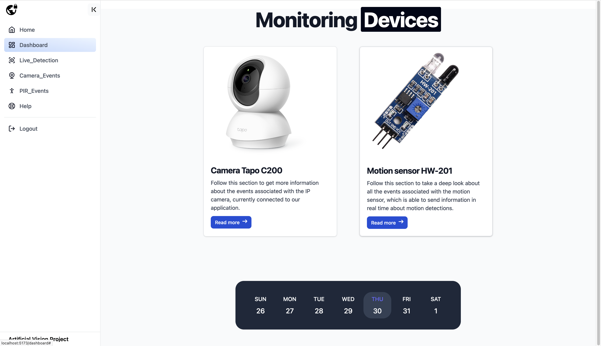
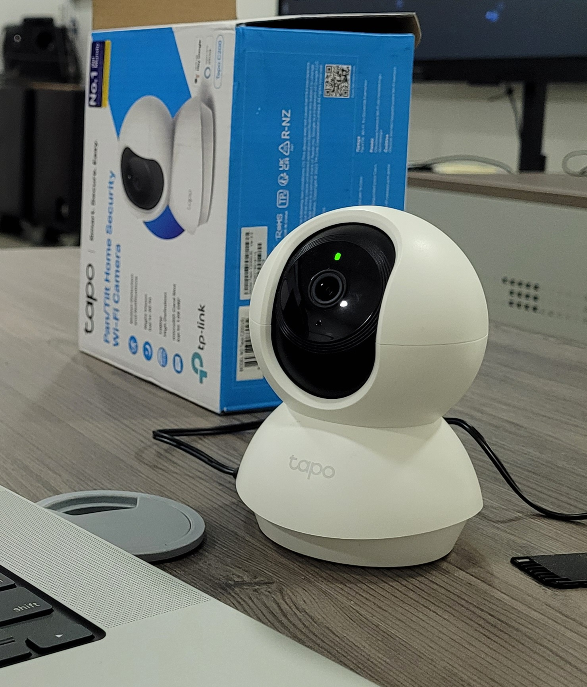
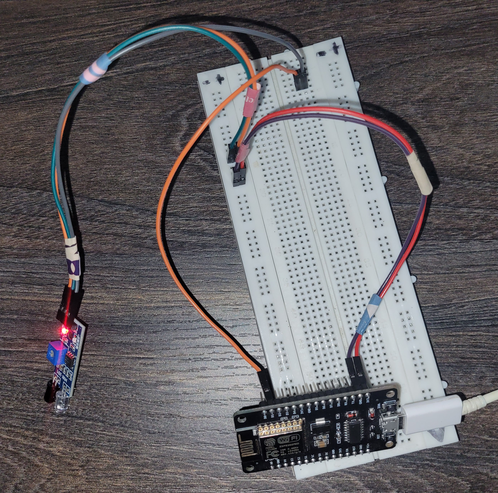
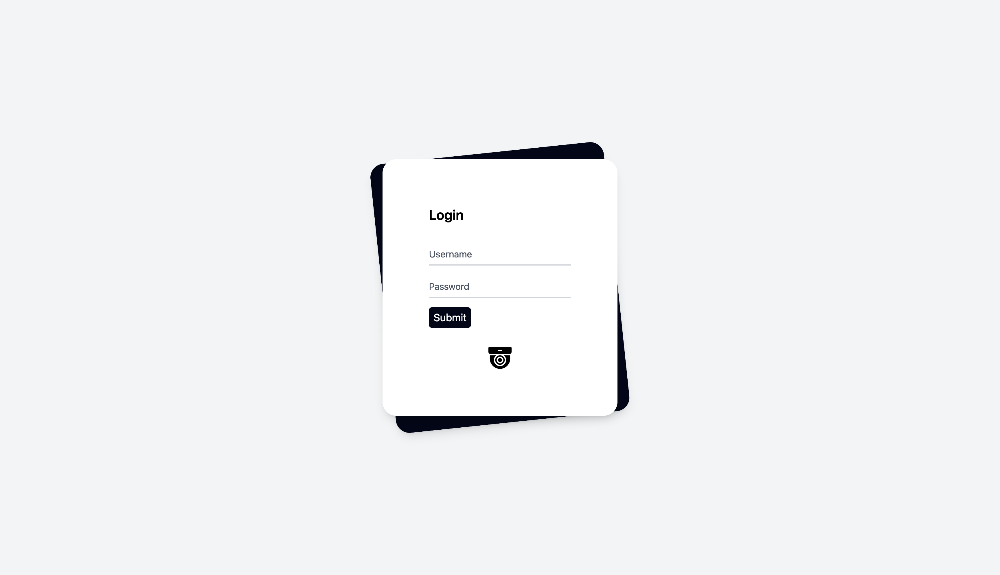
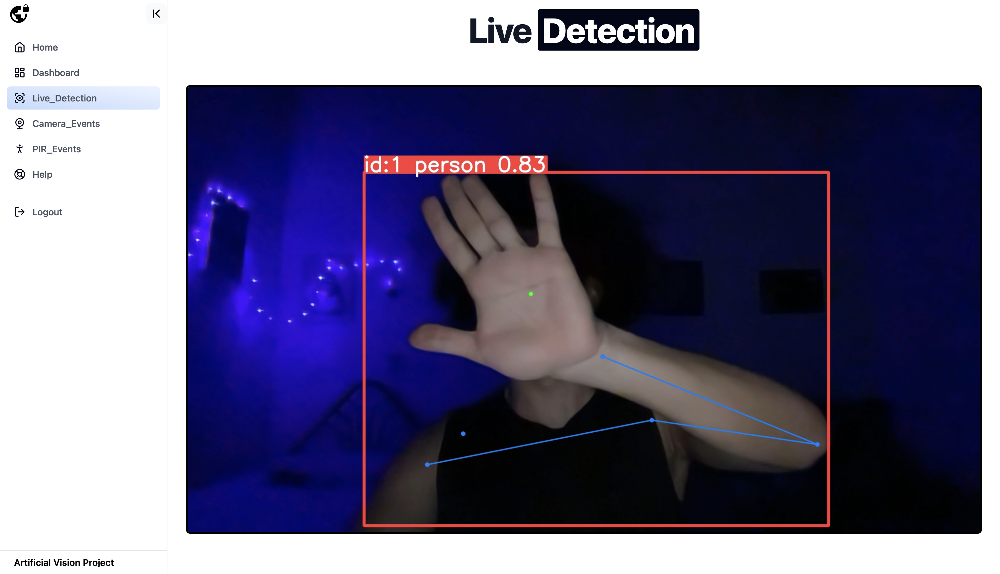
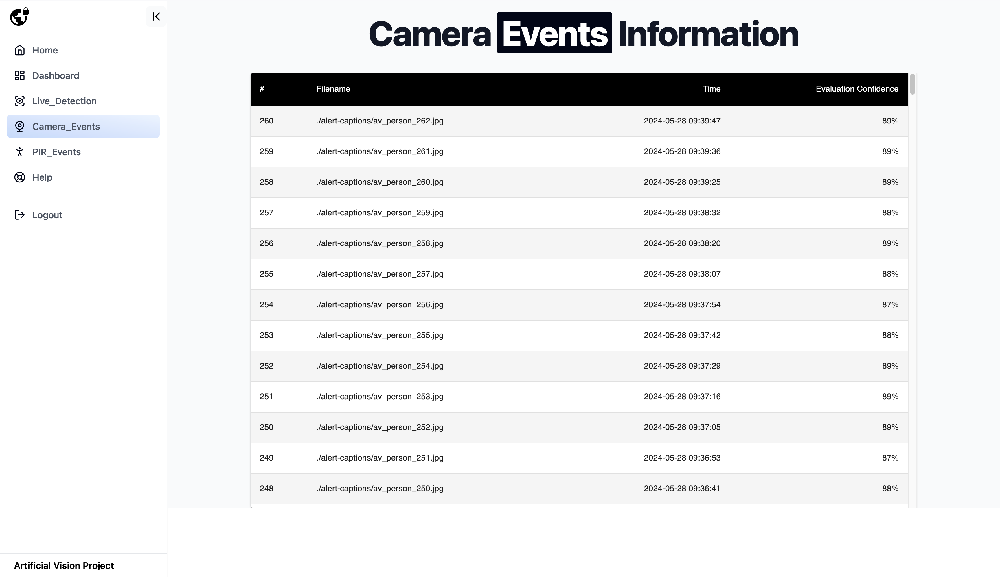
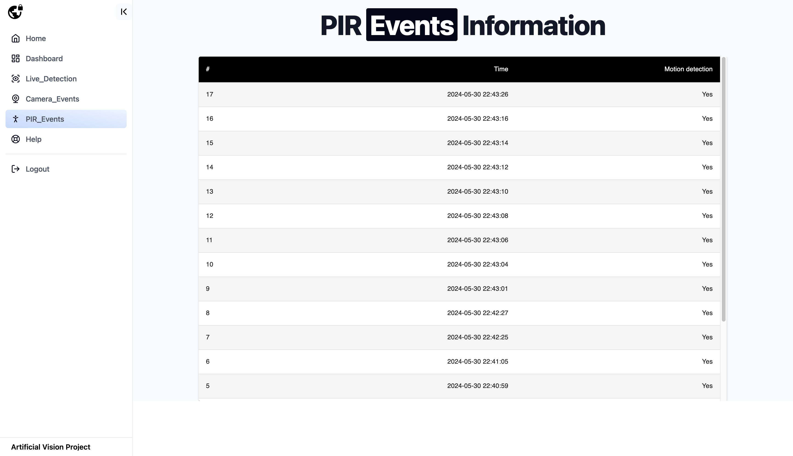
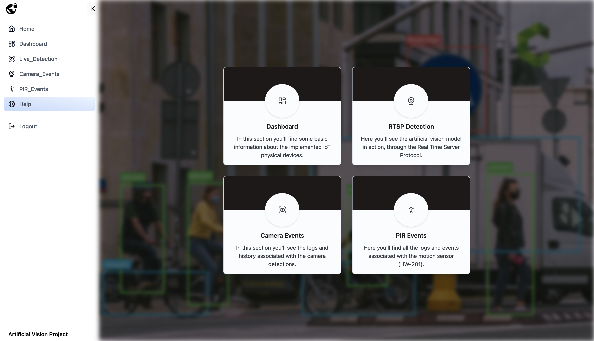
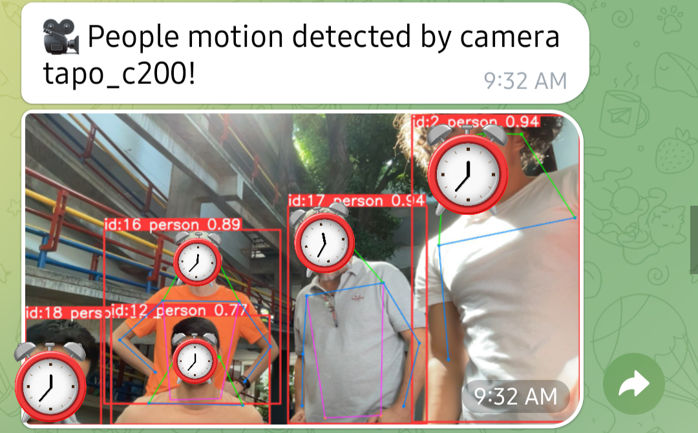
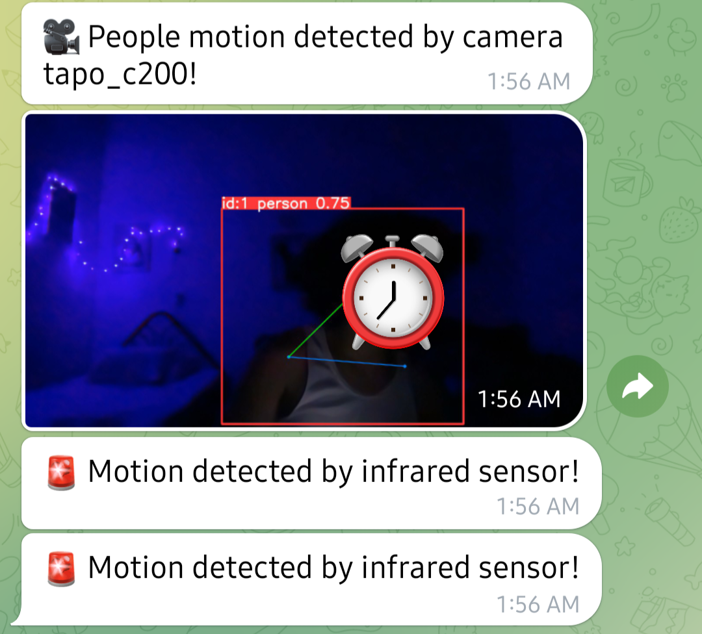

# Security IoT Application Based on Artificial Vision

## Overview
<table>
  <tr>
    <td></td>
    <td></td>
  </tr>
</table>

The following project aims to provide a security solution based on the implementation of IoT technologies and the use of an artificial vision model for real-time detection of the flow of people in a given space through a security camera that works under the RTSP protocol and an infrared motion sensor. The approach of this solution involves the integration of technologies that will allow the user to interact with a real-time monitoring system through a web application with three main modules:

1. **Real-time Video:** Displaying camera feed processed with artificial intelligence.
2. **Camera Events:** Records associated with the camera.
3. **PIR Events:** Events from the infrared sensor.

In addition, the application will have real-time alert notifications via Telegram.

## Hardware

<table>
  <tr>
    <td></td>
    <td></td>
  </tr>
  <tr>
    <td align="center">IP Camera Tapo C200</td>
    <td align="center">Circuit</td>
  </tr>
</table>

- IP Camera Tapo C200
- Laptop camera (for testing)
- HW-201 (motion sensor)
- ESP8266 (transfer motion sensor data via HTTP protocol)

## Software

### Programming Languages and Technologies

- Python (Ultralytics model use, Telegram bot configuration, motion sensor data capture)
- JavaScript (Frontend, events fetch)
- Tailwind CSS, Material UI (Frontend)
- Java [Spring Boot] (Backend - User validation, events fetch from DB)
- C++ (ESP8266 and HW-201 logic)
- Bash (Automation of Python scripts execution)
- MongoDB on cloud (storage events data)
- Ultralytics pre-trained models

## Application in action

### Login Page

### Live Detection Page

### Camera Events Page

### PIR Events

### Help Section

### Telegram Received Data Sample
<table>
  <tr>
    <td></td>
    <td></td>
  </tr>
</table>

### For more information look for the PDF documentation file located into "documentation" folder.

**Author:** @birdm4nw
